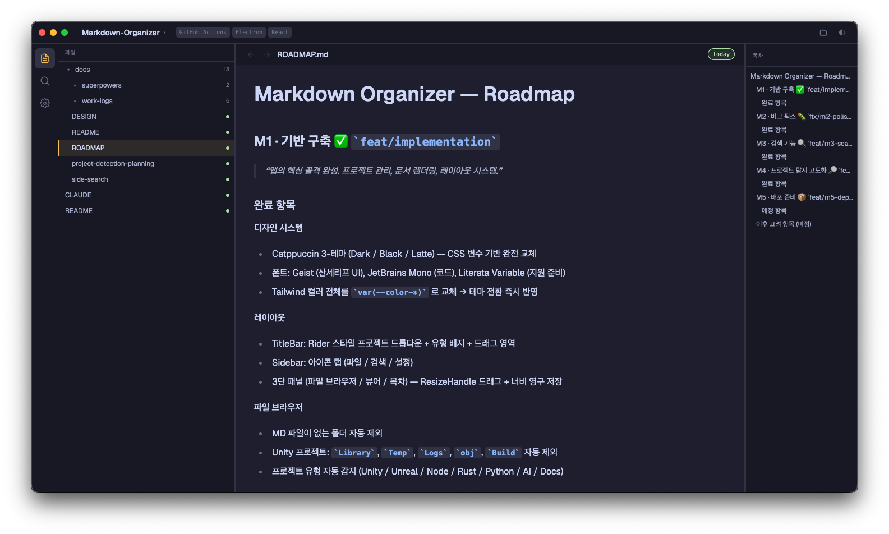

# Markdown Organizer

**AI가 생성한 Markdown 문서를 위한 데스크탑 워크스페이스.**

LLM(ChatGPT, Claude, Gemini)을 매일 쓰는 개발자를 위한 멀티 프로젝트 Markdown 관리 도구. 단순 뷰어가 아니라 프로젝트 단위로 문서를 탐색·관리하는 진지한 도구.

[](https://github.com/DIMBD-AKE/Markdown-Organizer/releases/latest)




---

## 기능

### 멀티 프로젝트 관리

여러 로컬 폴더를 프로젝트로 등록하고 전환. 마지막 열람 문서, 트리 펼침 상태, 스크롤 위치를 SQLite로 영구 저장 — 재시작 후 이전 작업 흐름 즉시 복원.

### 프로젝트 유형 자동 감지 (72룰)

폴더 구조·파일 패턴을 신뢰도 기반으로 분석해 프로젝트 유형 자동 판별.

| 유형 | 감지 기준 |
|------|----------|
| Unity | `Assets/`, `ProjectSettings/`, `.unity` |
| Unreal Engine | `.uproject`, `Source/`, `Content/` |
| Node.js / React / Next.js / Vue | `package.json`, 프레임워크 파일 |
| Rust | `Cargo.toml` |
| Python | `requirements.txt`, `pyproject.toml`, `setup.py` |
| Go | `go.mod` |
| Java / Kotlin / C# | 빌드 파일 + 소스 구조 |
| AI Research / Docs | Markdown 밀도 + 폴더 패턴 |
| 외 다수 | Swift, PHP, Ruby, Dart, C/C++, Zig, Lua … |

### Markdown 렌더링

- **GFM** 전체 지원 (테이블, 체크리스트, 각주)
- **Mermaid** 다이어그램 자동 렌더링 (Flowchart, Sequence, ERD, State, Gantt)
- **Shiki** 구문 강조 — Catppuccin Mocha 테마, 100+ 언어
- **내부 링크** 클릭 시 히스토리 관리하며 문서 이동 (뒤로/앞으로)

### 전문 탐색 도구

- **목차(TOC) 패널** — Heading 자동 추출, 스크롤 위치 동기화, 클릭 이동
- **문서 내 검색** — `Cmd+F` / `Ctrl+F`, 하이라이트 + 결과 간 이동
- **전체 검색** — 모든 프로젝트 Markdown 파일 풀텍스트 검색, 와일드카드 지원

### 신선도 배지

문서 최종 수정 시간 기준으로 자동 상태 표시:

| 상태 | 기준 |
|------|------|
| fresh | 7일 이내 |
| warn | 30일 이상 |
| stale | 90일 이상 |

AI 생성 문서의 갱신 필요 여부를 즉시 파악.

### 테마 시스템

[Catppuccin](https://github.com/catppuccin/catppuccin) 팔레트 기반 3종 테마. 설정 패널에서 즉시 전환.

| 테마 | 용도 |
|------|------|
| Mocha (Dark) | 기본 다크 |
| Black | OLED / 집중 모드 |
| Latte | 라이트 |

### 자동 업데이트

GitHub Releases 기반. 앱 시작 5초 후 자동 확인 — 설정 패널에서 수동 확인 및 설치 가능.

---

## 기술 스택

| 역할 | 기술 |
|------|------|
| 프레임워크 | Electron 31 + electron-vite |
| UI | React 18 + TypeScript |
| 스타일 | Tailwind CSS v4 + Catppuccin 변수 |
| 상태 관리 | Zustand |
| Markdown | react-markdown + remark-gfm + rehype-raw |
| 다이어그램 | Mermaid.js |
| 구문 강조 | Shiki |
| 데이터베이스 | better-sqlite3 (SQLite) |
| 파일 감시 | chokidar |
| 폰트 | Geist (UI) · Literata (문서 본문) · JetBrains Mono (코드) |
| 업데이트 | electron-updater |
| 패키징 | electron-builder |

---

## 설치

### 사전 준비

- Node.js 20+
- npm

```bash
git clone https://github.com/DIMBD-AKE/Markdown-Organizer.git
cd Markdown-Organizer
npm install
```

### 개발 서버

```bash
npm run dev
```

### 프로덕션 빌드

```bash
# macOS (DMG)
npm run build:mac

# Windows (NSIS 인스톨러 + Portable exe)
npm run build:win

# Linux (AppImage)
npm run build:linux
```

빌드 결과물은 `dist/` 에 생성됨.

---

## 릴리즈 (CI/CD)

`v*` 태그 push 시 GitHub Actions가 macOS / Windows / Linux 3개 플랫폼 병렬 빌드 후 GitHub Release에 자동 업로드.

```bash
git tag v1.0.0
git push origin v1.0.0
```

---

## 플랫폼 지원

| 플랫폼 | 형식 | 아키텍처 |
|--------|------|----------|
| macOS | DMG | x64, arm64 |
| Windows | NSIS 인스톨러, Portable exe | x64 |
| Linux | AppImage | x64 |

### macOS 첫 실행 시

코드사이닝 인증서 없이 배포되므로 Gatekeeper가 차단할 수 있습니다. 터미널에서 아래 명령 실행 후 열어주세요.

```bash
xattr -cr ~/Downloads/Markdown\ Organizer-*.dmg
# 또는 앱 번들을 직접:
xattr -cr /Applications/Markdown\ Organizer.app
```

