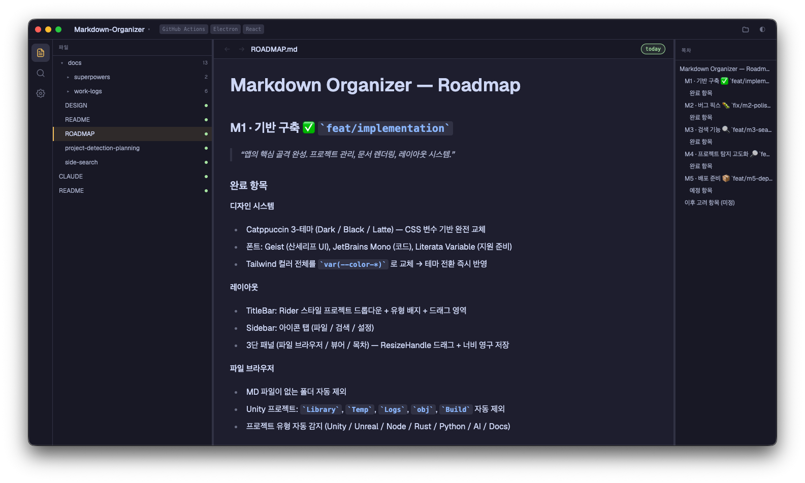

# Markdown Organizer

**AI가 생성한 Markdown 문서를 위한 데스크탑 워크스페이스.**

LLM(ChatGPT, Claude, Gemini)을 매일 쓰는 개발자를 위한 멀티 프로젝트 Markdown 관리 도구. 단순 뷰어가 아니라 프로젝트 단위로 문서를 탐색·관리하는 진지한 도구.

[](https://github.com/DIMBD-AKE/Markdown-Organizer/releases/latest)




---

## 기능

### 멀티 프로젝트 관리

여러 로컬 폴더를 프로젝트로 등록하고 전환. 마지막 열람 문서, 트리 펼침 상태, 스크롤 위치를 SQLite로 영구 저장 — 재시작 후 이전 작업 흐름 즉시 복원.

### 프로젝트 유형 자동 감지 (72룰)

폴더 구조·파일 패턴을 신뢰도 기반으로 분석해 프로젝트 유형 자동 판별.

| 유형 | 감지 기준 |
|------|----------|
| Unity | `Assets/`, `ProjectSettings/`, `.unity` |
| Unreal Engine | `.uproject`, `Source/`, `Content/` |
| Node.js / React / Next.js / Vue | `package.json`, 프레임워크 파일 |
| Rust | `Cargo.toml` |
| Python | `requirements.txt`, `pyproject.toml`, `setup.py` |
| Go | `go.mod` |
| Java / Kotlin / C# | 빌드 파일 + 소스 구조 |
| AI Research / Docs | Markdown 밀도 + 폴더 패턴 |
| 외 다수 | Swift, PHP, Ruby, Dart, C/C++, Zig, Lua … |

### Markdown 렌더링

- **GFM** 전체 지원 (테이블, 체크리스트, 각주)
- **Mermaid** 다이어그램 자동 렌더링 (Flowchart, Sequence, ERD, State, Gantt)
- **Shiki** 구문 강조 — Catppuccin Mocha 테마, 100+ 언어
- **내부 링크** 클릭 시 히스토리 관리하며 문서 이동 (뒤로/앞으로)

### 전문 탐색 도구

- **목차(TOC) 패널** — Heading 자동 추출, 스크롤 위치 동기화, 클릭 이동
- **문서 내 검색** — `Cmd+F` / `Ctrl+F`, 하이라이트 + 결과 간 이동
- **전체 검색** — 모든 프로젝트 Markdown 파일 풀텍스트 검색, 와일드카드 지원

### 신선도 배지

문서 최종 수정 시간 기준으로 자동 상태 표시:

| 상태 | 기준 |
|------|------|
| fresh | 7일 이내 |
| warn | 30일 이상 |
| stale | 90일 이상 |

AI 생성 문서의 갱신 필요 여부를 즉시 파악.

### 테마

[Catppuccin](https://github.com/catppuccin/catppuccin) 팔레트 기반 테마를 설정 패널에서 선택 가능. 상단바는 읽기 흐름과 폴더 이동에 집중하도록 간소화.

---

## 기술 스택

| 역할 | 기술 |
|------|------|
| 프레임워크 | Tauri 2 + Vite |
| UI | React 18 + TypeScript |
| 스타일 | Tailwind CSS v4 + Catppuccin 변수 |
| 상태 관리 | Zustand |
| Markdown | react-markdown + remark-gfm + rehype-raw |
| 다이어그램 | Mermaid.js |
| 구문 강조 | Shiki |
| 데이터베이스 | Rust rusqlite (SQLite) |
| 파일 감시 | Rust notify |
| 폰트 | Geist (UI) · Literata (문서 본문) · JetBrains Mono (코드) |
| 배포 | 로컬 빌드 + GitHub Release 업로드 |
| 패키징 | Tauri bundler |

---

## 설치

### 사전 준비

- Node.js 20+
- npm

```bash
git clone https://github.com/DIMBD-AKE/Markdown-Organizer.git
cd Markdown-Organizer
npm install
```

### 개발 서버

```bash
npm run dev
```

### 프로덕션 빌드

```bash
# macOS (.app.zip + .dmg, 현재 머신 아키텍처)
npm run build:mac

# Windows (NSIS 설치파일, 현재 머신 아키텍처)
npm run build:win

# Linux (AppImage, x64)
npm run build:linux
```

프론트엔드 빌드는 `dist/` 에 생성되고, 앱 번들은 `src-tauri/target/release/bundle/` 아래에 생성됨.

---

## 릴리즈 (로컬 빌드 후 업로드)

GitHub Actions 빌드는 사용하지 않음. 릴리즈할 플랫폼에서 로컬 빌드를 만든 뒤 GitHub CLI로 Release에 업로드.

```bash
# 1. 현재 플랫폼용 로컬 빌드
npm run build:mac      # macOS
npm run build:win      # Windows
npm run build:linux    # Linux

# 2. GitHub Release에 산출물 업로드
npm run release:local -- --tag=v1.3.0 --notes-file=release-notes/v1.3.0.md
```

업로드 전 `dist/release/vX.Y.Z/`에 릴리즈용 파일명이 정리되고 `SHA256SUMS_X.Y.Z.txt`가 생성됨.

---

## 플랫폼 지원

| 플랫폼 | 형식 | 아키텍처 | 비고 |
|--------|------|----------|------|
| macOS | `.app` / `.dmg` | 현재 빌드 머신 아키텍처 | `/Applications` 로 드래그 |
| Windows | NSIS Setup (`.exe`) | 현재 빌드 머신 아키텍처 | 일반 설치 형식 |
| Linux | AppImage | x64 | 실행 권한 부여 후 더블클릭 |

### macOS 첫 실행 시

> Apple Developer ID 인증서 + 공증(notarization) 없이 배포되므로 Gatekeeper가 차단합니다.
> 다이얼로그: *"Apple은 '...'에 사용자의 Mac에 손상을 입히거나 사용자의 개인정보에 침입할 수 있는 악성 코드가 없음을 확인할 수 없습니다."*

다음 중 한 가지 방법으로 실행할 수 있습니다.

**옵션 A — 시스템 설정에서 허용 (1회):**

1. 앱 더블클릭 → "확인할 수 없음" 다이얼로그가 뜨면 "완료" 클릭.
2. **시스템 설정 → 개인정보 보호 및 보안** 으로 이동.
3. 하단 *"'Markdown Organizer'이(가) 확인되지 않은 개발자가 만든 것이므로 사용이 차단되었습니다."* 옆 **"그래도 열기"** 버튼 클릭.
4. 다음 다이얼로그에서 **"열기"** 확인 → 이후로는 정상 실행됩니다.

**옵션 B — 터미널 (1회):**

```bash
# 다운로드한 zip을 압축 해제하고 Markdown Organizer.app 을 /Applications 으로 옮긴 후
xattr -cr /Applications/Markdown\ Organizer.app
```

quarantine 확장 속성 제거 → Gatekeeper 체크 우회. 신뢰할 수 있는 출처(GitHub Releases)에서 받은 빌드에만 사용하세요.

> 앱 데이터는 Tauri 앱 데이터 디렉터리에 저장됩니다.
